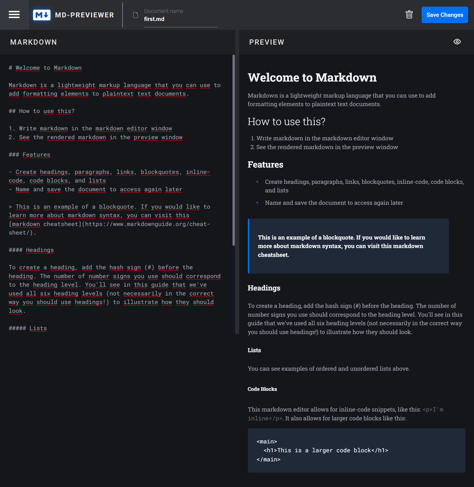

<div id="top"></div>

<!-- PROJECT HEADER -->
<br />
<div align="center">
  <a href="https://github.com/kajtd/md-previewer">
    📄
  </a>

<a href="https://md-preview-editor.netlify.app/">
  <h3 align="center">MD-Previewer</h3>
</a>
  <p align="center">
    MD-Previewer is a fully-functional in-browser markdown editor application.
  </p>
</div>

<!-- TABLE OF CONTENTS -->
<details>
  <summary>Table of Contents</summary>
  <ul>
    <li><a href="#about-the-project">About The Project</a></li>
    <li><a href="#technologies">Technologies</a></li>
    <li><a href="#getting-started">Getting Started</a></li>
    <li><a href="#usage">Usage</a></li>
    <li><a href="#roadmap">Roadmap</a></li>
    <li><a href="#contributing">Contributing</a></li>
    <li><a href="#license">License</a></li>
    <li><a href="#acknowledgments">Acknowledgments</a></li>
  </ul>
</details>

<!-- ABOUT THE PROJECT -->

## About The Project



MD-Previewer is a lightweight markup language that you can use to add formatting elements to plaintext text documents.

<!-- TECHNOLOGIES -->

## Technologies

```js
- Vue: 3.2.37
- Typescript: 4.7.4
- Pinia: 2.0.20
- Showdown: 2.1.0
```

<p align="right">(<a href="#top">back to top</a>)</p>
<!-- GETTING STARTED -->

## Getting Started

Here is how you can set up this project by yourself.
To get a local copy up and running follow these simple example steps.

### Installation

1.  Clone the repository.
2.  Install NPM packages and run the app.
    ```sh
    npm install
    npm run dev
    ```

<p align="right">(<a href="#top">back to top</a>)</p>

<!-- USAGE -->

## Usage

Below you can read the instructions on how to use MD-Previewer app.

<ol>
    <li>Create, Read, Update, and Delete markdown documents</li>
    <li>Name and save documents to be accessed as needed</li>
    <li>Edit the markdown of a document and see the formatted preview of the content</li>
    <li>View the optimal layout for the app depending on their device's screen size</li>
</ol>

The current state of the document is saved in localStorage, so it is retained when the browser is refreshed.

<p align="right">(<a href="#top">back to top</a>)</p>

<!-- ROADMAP -->

## Roadmap

- [ ] Add dark/light mode theme switch
- [ ] Save data in the backend

<p align="right">(<a href="#top">back to top</a>)</p>

<!-- CONTRIBUTING -->

## Contributing

Any contributions you make are **greatly appreciated**.

If you have a suggestion that would make this better, please fork the repo and create a pull request. You can also simply open an issue.

1. Fork the Project
2. Create your Feature Branch (`git checkout -b feature/AmazingFeature`)
3. Commit your Changes (`git commit -m 'Add some AmazingFeature'`)
4. Push to the Branch (`git push origin feature/AmazingFeature`)
5. Open a Pull Request

<p align="right">(<a href="#top">back to top</a>)</p>

<!-- LICENSE -->

## License

Distributed under the MIT License. See `LICENSE.txt` for more information.

<p align="right">(<a href="#top">back to top</a>)</p>

## Acknowledgments

- [Frontend-Mentor](https://www.frontendmentor.io/challenges/inbrowser-markdown-editor-r16TrrQX9)
- [Best-README-Template](https://github.com/othneildrew/Best-README-Template)

<p align="right">(<a href="#top">back to top</a>)</p>
